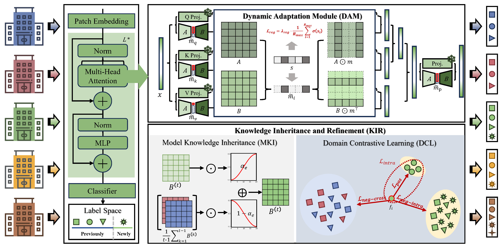

# DK-DDIL: Adaptive Knowledge Retention for Dynamic Domain-Incremental Learning in Medical Imaging

[](https://cvpr.thecvf.com/)
[]()
[](LICENSE)

📄 **Paper**: [DK-DDIL: Adaptive Knowledge Retention for Dynamic Domain-Incremental Learning in Medical Imaging]()

## Overview

DK-DDIL is a rehearsal-free dynamic domain-incremental learning framework designed for evolving medical imaging scenarios. Clinical imaging data continuously evolves due to new scanners, institutions, and disease subtypes. Traditional DIL methods assume:

- Fixed label spaces
- Limited domain shifts

DK-DDIL enables dynamic domain adaptation without rehearsal 
via two synergistic modules:

1. 🔄**Dynamic Adaptation Module (DAM)**
   - Dynamic rank selection
   - Adaptive regularization

2. 🧠**Knowledge Inheritance & Refinement (KIR)**
   - Selective adapter fusion
   - Prototype-level contrastive refinement

Our method consistently outperforms SOTA DIL methods across 2D, 3D medical imaging, and natural image benchmarks.

<p align="center">
  
</p>

## Environment
You can create a conda environment and run the following command to install the dependencies.
```
conda create -n DK-DDIL python=3.10 -y
conda activate DK-DDIL
pip install torch==2.0.1 torchvision==0.15.2 --index-url https://download.pytorch.org/whl/cu118
pip install -r requirements.txt
```

## Datasets Preparation

There are **3** datasets involved in the paper, ***Skin Pathology Diagnosis***, ***Cyst-X*** and ***Office-Home*** respectively. Follow the two-step guideline to prepare them for the reproduction.

---

### 1. Download datasets ###
Please download the datasets mannually according the recommended sources.  

#### 1.1 Skin Pathology Diagnosis

Please download the data for each center using the links provided below:

- **PH2**: https://huggingface.co/datasets/Shah1st/PH2. 

- **BCN**: https://figshare.com/articles/journal_contribution/BCN20000_Dermoscopic_Lesions_in_the_Wild/24140028/1.  

- **HAM / MSK / OTHER**: https://challenge.isic-archive.com/data/#2019.

- **derm_D7P**: https://derm.cs.sfu.ca/Download.html.  

- **dermoscopic**: https://api.isic-archive.com/doi/milk10k/.  

---

#### 1.2 Cyst-X

- Dataset link: https://osf.io/74vfs/overview. 

Please download:

- `IPMN_Classification/t1_clean_ROI.zip`
- `IPMN_labels_t1_total.csv`

---

#### 1.3 Office-Home

- Dataset link: https://hemanthdv.github.io/officehome-dataset/.  

---

### 2. Data Preprocessing ###

We first organize the datasets into domains and corresponding classes for each domain as follows:

#### 2.1 Skin Pathology Diagnosis   

- **PH2**: 
  Images are categorized into two lesion types (**NV** and **MEL**) based on the Parquet file descriptions. 

- **BCN**: 
  Images are grouped according to the `"diagnosis"` field in the provided CSV file.
  
- **HAM & MSK**: 
  - Samples from the ISIC 2019 Challenge training set are selected into HAM/MSK/BCN centers based on the `"lesion_id"` field in `meta.csv`. 
  - Samples whose `"lesion_id"` is neither `NaN` nor associated with HAM/MSK/BCN are merged into the **MSK** domain. 
  - The HAM and MSK samples are then categorized based on the labels provided in GroundTruth.csv.

- **OTHER**  
  The ISIC 2019 test set is treated as a separate domain named **OTHER**.

- **derm_D7P**  
  - The `"diagnosis"` in `meta.csv` is mapped to predefined lesion categories.
  - Samples corresponding to the `"derm"` column are then organized according to these mapped labels.  

- **dermoscopic**  
  - Samples are selected based on the `"image_type"` in `meta.csv` to construct the dermoscopic domain. 
  - These samples are categorized according to their labels in `gt.csv`. 

---

#### 2.2 Cyst-X

- `"Patient ID"` in `IPMN_labels_t1_total.csv` corresponds to the filename of each sample. 
- Samples are grouped into centers (e.g., AHN, MCF) based on filename prefix.
- `"risk assessment"` is used as the class label for categorization.

---

#### 2.3 Office-Home

The original dataset contains four different artistic styles, which naturally correspond to four domains.  
The existing folder structure already matches our required organization.

---

### 3. Dataset Splitting

For each domain:

- We use **stratified sampling**
- Train/Test split ratio = **4:1**
- Class distribution is preserved within each domain

<!-- 整理数据集的domains以及每个domain的classes：
    - **Skin Pathology Diagnosis**: 
      - *PH2*:根据Parquet文件中存储的图像和description，将图像分为NV和MEL两种病变类别；
      - *BCN*:根据csv文件的"diagnosis"字段将图像分类存放；
      - *HAM、MSK*:在ISIC 2019 Challenge的训练集中，根据meta.csv中的"lession_id"字段筛选出HAM、MSK、BCN三个中心的样本，对于"lession_id"字段既不是nan，也不属于MSK/BCN/HAM的样本，合并到MSK中心，而后按照GroundTruth.csv中的字段将HAM、MSK的样本分类存放。
      - *OTHER*:将ISIC 2019的测试集作为OTHER中心的样本。
      - *derm_D7P*:首先将meta.csv中的"diagnosis"字段转化为我们设定的皮肤病变标签，而后将"derm"列对应的样本分类存放。
      - *dermoscopic*:根据meta.csv中的"image_type"字段筛选出dermoscopic中心的样本，而后将这些样本按照gt.csv中对应的标签分类存放。
    - **Cyst-X**: IPMN_labels_t1_total.csv中的"Patient ID"字段对应每个样本的文件名，根据其文件名前缀，将样本分为AHN、MCF等中心，而后将"risk assessment"字段作为标签，将样本分类存放。
    - **Office-Home**: 原数据集文件夹下有四种不同风格，即四个不同的domain，已经符合我们的数据集结构。
    **Dataset Splitting**: 对每个domain，按照分层抽样的方式，将数据集划分为训练集和测试集，训练集:测试集=4:1。 -->

### 4. Check structure ###

After downloading and preprocessing, place all dataset files under the `./data/` directory.

The expected directory structure is:

```
data/
├── Skin/
│ ├── BCN/
│ │ ├── class0/
│ │ │ └── images/
│ │ ├── class1/
│ │ └── ...
│ ├── BCN_train.txt
│ ├── BCN_test.txt
│ └── ...
│
├── Cyst-X/
│ ├── AHN/
│ │ ├── class0/
│ │ │ └── images/
│ │ ├── class1/
│ │ └── ...
│ ├── AHN_train.txt
│ ├── AHN_test.txt
│ └── ...
│
└── OfficeHome/
├── Art/
│ ├── class0/
│ │ └── images/
│ ├── class1/
│ └── ...
├── Art_train.txt
├── Art_test.txt
└── ...

```

<!-- ```
    Skin
    ├── BCN
      ├── class0
        ├── images
      ├── class1
      ├── ...(other classes)
    ├── BCN_test.txt
    ├── BCN_train.txt
    ├── ...(other domains)

    Cyst-X
    ├── AHN
      ├── class0
        ├── images
      ├── class1
      ├── ...(other classes)
    ├── AHN_test.txt
    ├── AHN_train.txt
    ├── ...(other domains)

    OfficeHome
    ├── Art
      ├── class0
        ├── images
      ├── class1
      ├── ...(other classes)    
    ├── Art_test.txt
    ├── Art_train.txt
    ├── ...(other domains)
```   -->


## Getting Started

### Training

To train the model, navigate to the main directory and run:

```
python main.py --config <json_config_path>
```

### Supported Datasets

The following datasets are supported with pre-configured JSON files:

#### Skin Pathology Diagnosis
```
python main.py --config exps/skin.json
```
#### Cyst-X
```
python main.py --config exps/cystx.json
```
#### Office-Home
```
python main.py --config exps/officehome.json
```


## Citation

If you find this work useful in your research, please cite:

```bibtex
@article{yxma_2026_CVPR,
    author    = {},
    title     = {DK-DDIL: Adaptive Knowledge Retention for Dynamic Domain-Incremental Learning in Medical Imaging},
    journal = {Proceedings of the Computer Vision and Pattern Recognition Conference (CVPR)},
    month     = {June},
    year      = {2026},
    pages     = {}
}
```

## Acknowledgments

This implementation builds upon the **LAMDA-PILOT** and **CL-LoRA** framework. 

**LAMDA-PILOT Repository**: https://github.com/sun-hailong/LAMDA-PILOT  
**CL-LoRA Repository**: https://github.com/JiangpengHe/CL-LoRA

## License

This project is licensed under the MIT License - see the [LICENSE](LICENSE) file for details.

## Contact

For questions or issues, please open an issue on GitHub or contact the authors.
